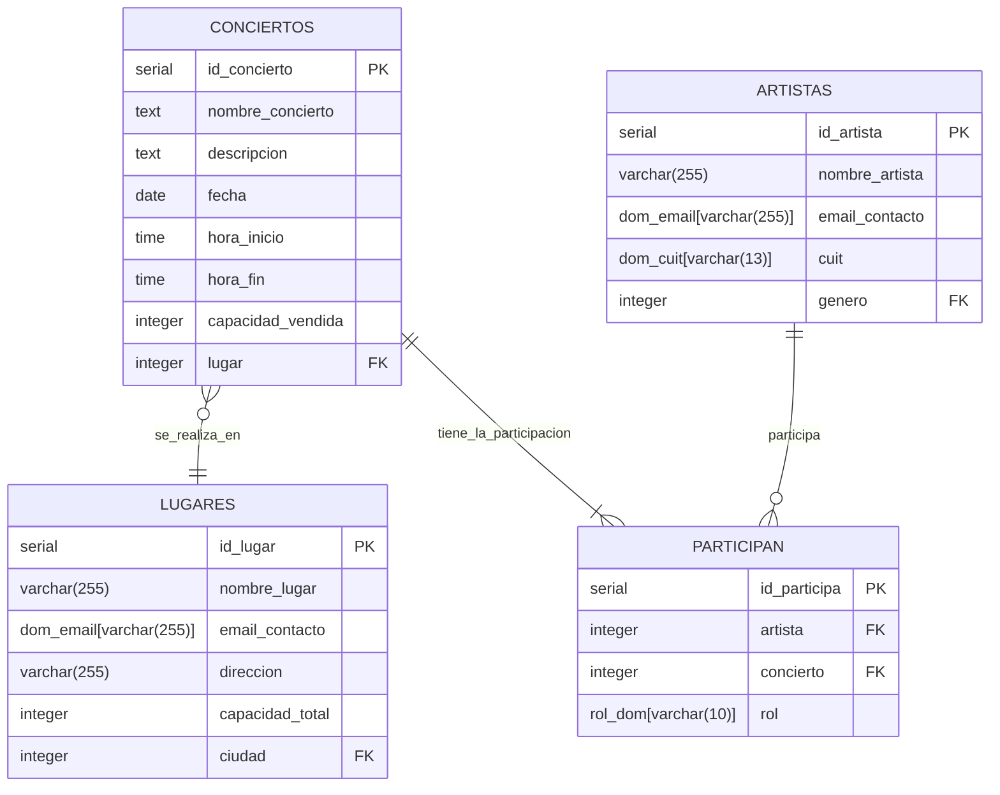

# Diccionario de Datos  
## Sistema de Gestión de Conciertos
**Entorno:** PostgreSQL 18  
**Versión:** 1.0    
**Año:** 2026    
**Mes:** Abril  
**Responsable:** Grupo 2 (Mateo Salcedo, Tobias Centurion, Camila Tenorio)

# 1. Descripción del modelo

La base de datos del Sistema de Gestión de Conciertos tiene como objetivo gestionar de manera estructurada la información central de la plataforma: conciertos, artistas, lugares, clientes, tipos de entradas, compras y la relación entre artistas y conciertos.

Su diseño permite almacenar eventos musicales, administrar relaciones entre entidades (por ejemplo, qué artista participa en cada concierto, en qué lugar se realiza, qué clientes compran entradas) y garantizar integridad, consistencia y trazabilidad de los datos.

El modelo fue pensado bajo principios de normalización y buenas prácticas relacionales, asegurando escalabilidad, calidad de datos y soporte para futuras funcionalidades del sistema.

# 2. Información General
Sistema transaccional (OLTP) destinado a la gestión de:

    -Conciertos
    -Artistas
    -Lugares
    -Clientes
    -Tipos de entradas
    -Compras
    -Participación de artistas en conciertos

Dominio de negocio: Gestión de eventos musicales y venta de entradas.
---

# 3. Dominios Definidos

## 3.1. dom_cuit
- Tipo base: `VARCHAR(13)`
- Permite valores que cumplan la expresión regular: `^[0-9]{2}-[0-9]{8}-[0-9]$`
```sql
CONSTRAINT chk_dom_cuit CHECK (VALUE ~ '^[0-9]{2}-[0-9]{8}-[0-9]$');
```

## 3.2. dom_email
- Tipo base: `VARCHAR(255)`
- Permite valores que cumplan la expresión regular: `^[A-Za-z0-9._%+-]+@[A-Za-z0-9.-]+\.[A-Za-z]{2,}$`
```sql
CONSTRAINT chk_dom_email CHECK (VALUE ~ '^[A-Za-z0-9._%+-]+@[A-Za-z0-9.-]+\.[A-Za-z]{2,}$');
```

## 3.3. rol_dom
- Tipo base: `VARCHAR(10)`
- Valores permitidos:
  - PRINCIPAL
  - INVITADO
```sql
CHECK (VALUE IN ('PRINCIPAL', 'INVITADO'));
```

# 4. Definición de Tablas

---

## Tabla: artistas

**Tipo:** Dato maestro

| Campo          | Tipo         | Nulo |PK |UK |FK | Descripción |
|----------------|--------------|------|---|---|---|-------------|          
| id_artista     | SERIAL       | No   | ✔ | - | - |Identificador único|    
| nombre_artista | VARCHAR(255) | No   | - | ✔ | - |Nombre único del solista o banda|
| email_contacto |dom_email     | No   | - | ✔ | - |Email de contacto único|
| cuit           |dom_cuit      | No   | - | ✔ | - |CUIT único|
| genero         |INTEGER       | No   | - | - | ✔ |FK a generos|

```sql
CONSTRAINT fk_genero_artista FOREIGN KEY (genero) REFERENCES generos(id_genero) ON UPDATE NO ACTION ON DELETE NO ACTION;
```

### Reglas de Validación — Artistas

#### Campo: `nombre_artista`
**Descripción:**  
Nombre del artista (solista o banda).

**Tipo de dato:** `VARCHAR(255)`

**Obligatoriedad:**
Requerido (`NOT NULL`)

**Unicidad:** 
Debe ser único dentro de la tabla (`UNIQUE`)
```sql
CONSTRAINT ck_artistas_nombre UNIQUE (nombre_artista)
```

**Normalización:** 
El valor debe almacenarse:
- Respetando el uso de mayúsculas y minúsculas original del nombre artístico.
- Sin espacios al inicio ni al final.
```sql
TRIM(nombre_artista)
``` 


#### Campo: `email_contacto`
**Descripción:**  
Dirección de correo electrónico de contacto del artista.

**Tipo de dato:** `dom_email`

**Obligatoriedad:**
Requerido (`NOT NULL`)

**Unicidad:** 
Debe ser único dentro de la tabla (`UNIQUE`)
```sql
CONSTRAINT ck_artistas_email UNIQUE (email_contacto)
```

**Normalización:**  
El valor debe almacenarse:
- Sin espacios al inicio ni al final.
- Sin espacios internos.
- Convertido a minúsculas.
```sql
LOWER(TRIM(email_contacto))
```
**Validación:**
El valor se valida mediante el dominio `dom_email`.
Debe corresponder a una dirección de correo electrónico válida según el formato general:
- Debe contener exactamente un carácter @.
- Debe existir una parte local antes de @.
- Debe existir un dominio válido después de @.
- La extensión del dominio debe tener al menos 2 caracteres.
- No debe permitir espacios.

**Formato requerido:**
```
local_part@dominio.ext
```

Expresión regular:
```regex
^[A-Za-z0-9._%+-]+@[A-Za-z0-9.-]+\.[A-Za-z]{2,}$
```

Ejemplos válidos:
| Valor ingresado             | Valor almacenado            |
| --------------------------- | --------------------------- |
| `juan.perez@example.com`    | `juan.perez@example.com`    |
| `Maria_Gomez99@empresa.com` | `maria_gomez99@empresa.com` |
| `USER+TEST@GMAIL.COM`       | `user+test@gmail.com`       |

Ejemplos inválidos:
| Valor ingresado       | Motivo                        |
| ----------------------| ------------------------------|
| `juan.perez`          |Falta `@` y dominio            |
| `juan@`               | Falta dominio                 |
| `@empresa.com`        | Falta parte local             |
| `juan @empresa.com`   | Contiene espacios             |
| `juan@empresa`        | Falta extensión del dominio   |
| `juan@empresa.c`      | Extensión demasiado corta     |
| `juan@@empresa.com`   | Contiene más de un `@`        |


#### Campo: `cuit`

**Descripción:**  
CUIT (Clave Única de Identificación Tributaria) del artista.

**Tipo de dato:** `dom_cuit`

**Obligatoriedad:**
Requerido (`NOT NULL`)

**Unicidad:** 
Debe ser único dentro de la tabla (`UNIQUE`)
```sql
CONSTRAINT ck_artistas_cuit UNIQUE (cuit)
```

**Validación:**
El valor se valida mediante el dominio `dom_cuit`.
Debe corresponder a un CUIT válido según el formato oficial definido por ARCA:
- Debe contener 11 dígitos numéricos, separados por `-` en tres partes:
  - Un prefijo de 2 dígitos.
  - 8 dígitos correspondientes al DNI o número de sociedad.
  - 1 dígito verificador.
- No debe permitir espacios ni caracteres adicionales.

**Formato requerido:**
```
XX-XXXXXXXX-X
```

Expresión regular:
```regex
^[0-9]{2}-[0-9]{8}-[0-9]$
```

Ejemplos válidos:
| Valor ingresado |
| ----------------|
| `20-12345678-3` |
| `30-82416434-2` | 

Ejemplos inválidos:
| Valor ingresado       | Motivo                                    |
| ----------------------| ------------------------------------------|
| `20123456783`         | Faltan separadores (`-`)                  |
| `20-1234567-3`        | Cantidad incorrecta de dígitos            |
| `AA-12345678-3`       | Contiene caracteres no numéricos          |
| `20_12345678_3`       | Separadores incorrectos (`_`)             |
| `20-12345678`         | Falta separador (`-`) y dígito verificador|
| `12345678-3`          | Falta prefijo y separador (`-`)           |
| `20-12345678-3 `      | Contiene espacios                         |

---
## Tabla: participan

**Tipo:** ??
**Descripción:** Tabla intermedia que representa la relación muchos a muchos entre artistas y conciertos, indicando el rol del artista en el concierto.

| Campo        | Tipo    | Nulo |PK |UK   |FK | Descripción |
|--------------|---------|------|---|-----|---|-------------|          
| id_participa | SERIAL  | No   | ✔ | -  | - | Identificador único|    
| artista      | INTEGER | No   | - | ✔* | ✔ | FK a artistas     |
| concierto    | INTEGER | No   | - | ✔* | ✔ | FK a conciertos   |   
| rol          | rol_dom | No   | - | -  | - | Rol del artista en el concierto|

```sql
CONSTRAINT ck_participan UNIQUE (artista,concierto); -- CK/AK compuesta
CONSTRAINT fk_participan_artista FOREIGN KEY (artista) REFERENCES artistas(id_artista) ON UPDATE NO ACTION ON DELETE NO ACTION;
CONSTRAINT fk_participan_concierto FOREIGN KEY (concierto) REFERENCES conciertos(id_concierto) ON UPDATE NO ACTION ON DELETE NO ACTION;
```
### Reglas de Validación — Participan

#### Campo: `rol`

**Descripción:**  
Rol del artista referenciado en el concierto referenciado.

**Tipo de dato:** `rol_dom`

**Obligatoriedad:**
Requerido (`NOT NULL`)

**Validación:**  
El valor se valida mediante el dominio `rol_dom`.

Valores permitidos:
- `PRINCIPAL`
- `INVITADO`

---
## Tabla: conciertos

**Tipo:** Dato Transaccional

| Campo          | Tipo         | Nulo |PK |UK |FK | Descripción |
|----------------|--------------|------|---|---|---|-------------|          
| id_concierto   | INTEGER      | No   | ✔ | - | - |Identificador único|    
| nombre_concierto| TEXT        | No   | - | ✔ | - |Nombre del evento
|descripcion     | TEXT         | Si   | - | - | - | Detalles adicionales del show|
| fecha          |DATE          | No   | - | ✔ | - |Fecha de realización|
 hora_inicio     |TIME          | No   | - | ✔ | - |Hora de comienzo|
| hora_fin       |TIME          | Si   | - | - | - |Hora estimada de finalización|
| capacidad_vendida|INTEGER     | No   | - | - | - |Cantidad de tickets emitidos|
| lugar          |INTEGER       | No   | - | - | ✔ |FK a la tabla lugares|

```sql
CONSTRAINT fk_concierto_lugar FOREIGN KEY (lugar) REFERENCES lugares(id_lugar) ON UPDATE NO ACTION ON DELETE NO ACTION;

```

### Reglas de Validación — Conciertos

#### Campo: `nombre_concierto`
**Descripción:**  
Nombre único que identifica al evento.

**Tipo de dato:** `TEXT`

**Obligatoriedad:**
Requerido (`NOT NULL`)

**Unicidad:** 
Forma parte de una clave única compuesta junto con fecha y hora_inicio.
```sql
CONSTRAINT ck_conciertos UNIQUE (nombre_concierto, fecha, hora_inicio)
```

**Normalización:** 
El valor debe almacenarse:
-Sin espacios al inicio ni al final.
- Se respeta mayúsculas/minúsculas según el nombre artístico del evento.
```sql
TRIM(nombre_concierto)
``` 
Validación:
No se permiten cadenas vacías.


#### Campo: `descripcion`
**Descripción:**  
Detalles adicionales del concierto.

**Tipo de dato:** `TEXT`

**Obligatoriedad:**
Opcional (`NULL permitido`)

**Unicidad:** 
No aplica

**Normalización:** 
El valor debe almacenarse:
- Sin espacios al inicio ni al final.
```sql
TRIM(descripcion)
``` 

**Validación:**  
Si se proporciona, no puede ser una cadena vacía.
```sql
CONSTRAINT chk_descripcion_no_vacia CHECK (descripcion IS NULL OR descripcion <> '')
``` 

#### Campo: `fecha`
**Descripción:**  
Fecha en que se realiza el concierto.

**Tipo de dato:** `DATE`

**Obligatoriedad:**
Requerido (`NOT NULL`)

**Unicidad:**
No es único por sí mismo. Forma parte de una clave única compuesta junto con nombre_concierto y hora_inicio.
```sql
CONSTRAINT ck_conciertos UNIQUE (nombre_concierto, fecha, hora_inicio)
``` 

**Validación:**
No se permiten fechas pasadas (regla de negocio: el concierto no puede ser en el pasado).
```sql
CONSTRAINT chk_fecha_futura CHECK (fecha >= CURRENT_DATE)
```

**Formato requerido:**
```
YYYY-MM-DD
```

EJEMPLOS VALIDOS


#### Campo: `hora_inicio`
**Descripción:**  
Hora de comienzo del concierto.

**Tipo de dato:** `TIME`

**Obligatoriedad:**
Requerido (`NOT NULL`)

**Unicidad:**
No es único por sí mismo. Forma parte de una clave única compuesta junto con nombre_concierto y fecha.
```sql
CONSTRAINT ck_conciertos UNIQUE (nombre_concierto, fecha, hora_inicio)
```

**Normalización:**  
El valor debe almacenarse en formato de 24 horas.

**Validación:**
No se permiten horas negativas o inexistentes 

**Formato requerido:**
```
HH:MI:SS
```

EJEMPLOS

#### Campo: `hora_fin`

**Descripción:**  
Hora de finalización del concierto.
**Tipo de dato:** `TIME`

**Obligatoriedad:**
Opcional (`NULL permitidos`)

**Formato requerido:**
HH:MI:SS

**Normalización:**  
El valor debe almacenarse en formato de 24 horas.

**Validación:**  
Si se especifica, debe ser mayor que hora_inicio.
```sql
CONSTRAINT chk_horario_valido CHECK ((hora_fin IS NULL) OR (hora_inicio < hora_fin))
```


#### Campo: `capacidad_vendida`

**Descripción:**  
Cantidad de entradas vendidas para el concierto.
**Tipo de dato:** `INTEGER`

**Obligatoriedad:**
Requerido (`NOT NULL`)

**Validación:**  
No puede ser negativo
```sql
CONSTRAINT conciertos_capacidad_vendida_check CHECK ((capacidad_vendida >= 0))
```


#### Campo: `lugar`

**Descripción:**  
Referencia al lugar físico donde se realiza el concierto.
**Tipo de dato:** `INTEGER`

**Obligatoriedad:**
Requerido (`NOT NULL`)

**Validación:**  
El valor debe existir en la tabla lugares
```sql
CONSTRAINT fk_concierto_lugar FOREIGN KEY (lugar) REFERENCES lugares(id_lugar) ON UPDATE NO ACTION ON DELETE NO ACTION
```
**Referencia:** `lugares(id_lugar)`


---
# 5. Reglas de Calidad de Datos

# 6. Clasificación de Datos

| Tabla        | Clasificación sugerida     | Comentario    |
| -------------| ---------------------------| --------------|
| `conciertos` |                            |               |
| `artistas`   |                            |               |
| `lugares`    |                            |               |
| `participan` |                            |               |


# 7. Diagrama Entidad–Relación (Mermaid)


